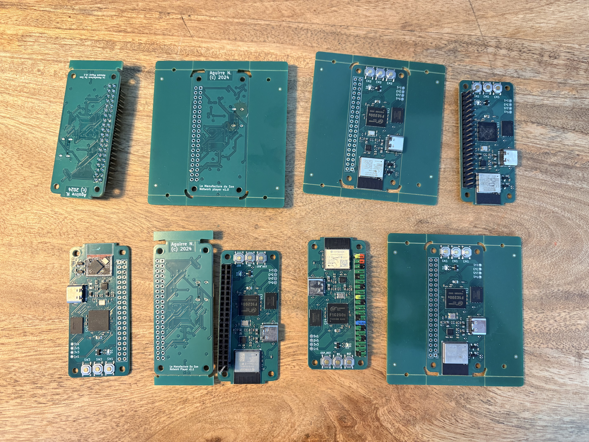
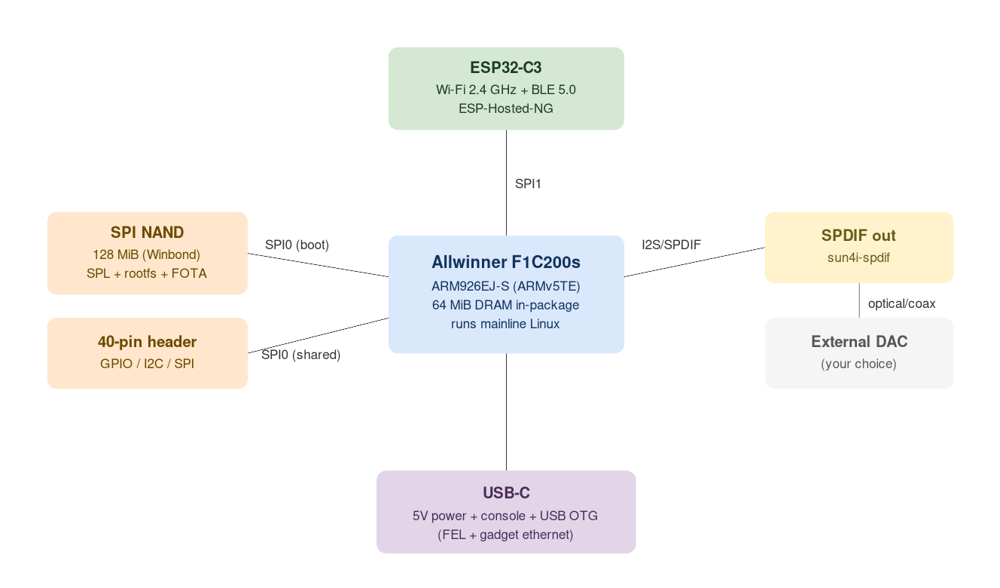
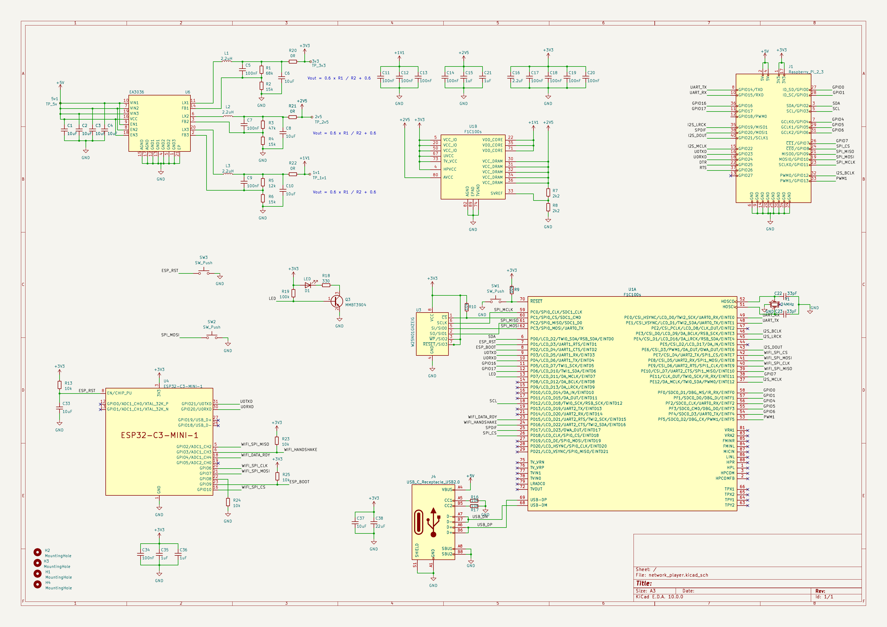
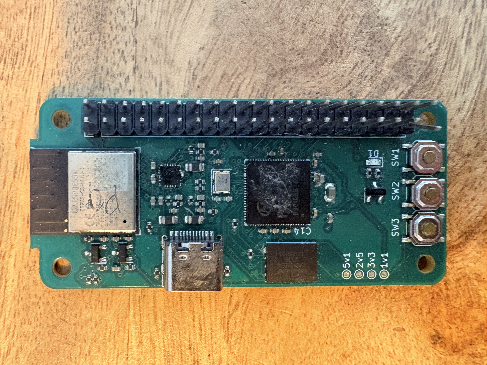
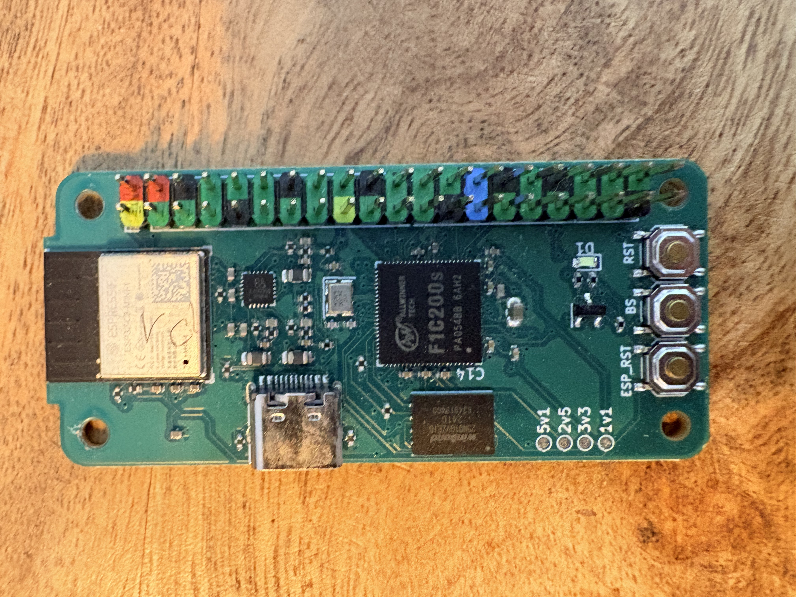
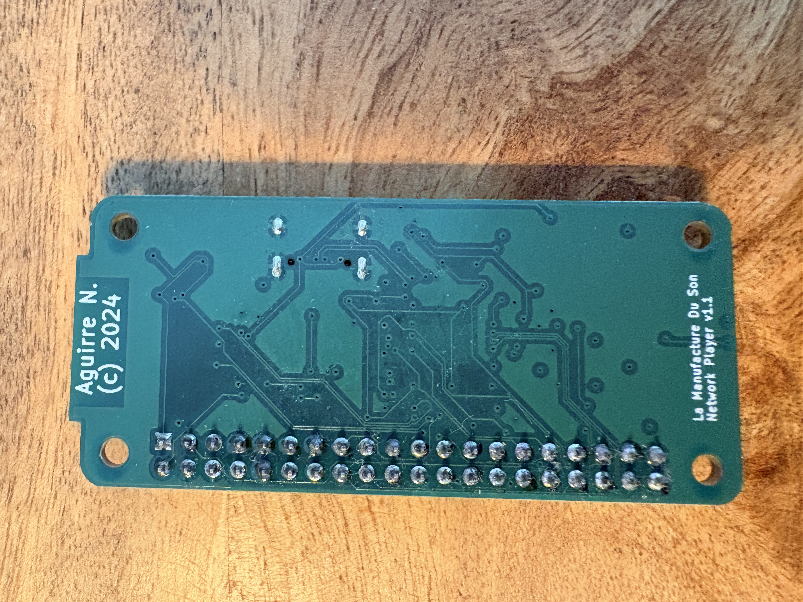

Hello
===

> Toulouse Embedded Meetup, 16 June 2026

# Who am I

- **Nicolas Aguirre**, embedded software engineer at **Loft Orbital**
- Building Linux kernels since the beginning of the century (maybe the last one)
- Background in electronics and FPGA

<!-- pause -->

## Why this project

- I love listening to music, but I love the gear even more:
  amplifiers, DACs, A/V receivers, radios
- I love open hardware and open source, so I wanted a small network
  audio streamer that *I* fully control
- I love learning, so this was an excuse to go end to end:
  schematic, PCB, bring-up, Linux, audio

<!-- pause -->

> "If you do not own a PCBA by 50, you have wasted your life."
> Jacques S, 2009.

> The whole thing is open source: hardware (CERN-OHL-P) and software (MIT).
> `https://naguirre.github.io/mds-builder/`

<!-- end_slide -->

What we are building
===



<!-- speaker_note: the family of boards across versions -->

<!-- end_slide -->

The product in one sentence
===

# A headless SPDIF network streamer

<!-- pause -->

- Plug it into the network, it exposes digital audio over SPDIF
- Pair it with the DAC of your choice
- Powered and reachable over a single USB-C cable

<!-- pause -->

```
   [ network / wifi ]
          |
     +----------+        SPDIF
     |   MDS    | ----------------> [ external DAC ] --> sound
     +----------+
          |
        USB-C  (power + console + gadget ethernet)
```

<!-- end_slide -->

Agenda
===

1. Hardware architecture, the silicon
2. CAD with KiCad, drawing the thing
3. Routing and constraints, making it manufacturable
4. Sending it to production, JLCPCB
5. Receiving the board and bootstrap, first power-up
6. Embedded dev as a logbook, the real story with bugs included
7. The result

<!-- end_slide -->

1. Hardware architecture
===

# Block diagram



<!-- end_slide -->

1. Hardware architecture
===

# The silicon

<!-- column_layout: [3, 2] -->

<!-- column: 0 -->

**Main SoC, Allwinner F1C200s**

- ARM926EJ-S, ARMv5TE
- 64 MiB DRAM packaged inside the SoC
- Cheap, tiny, mainline Linux support
- Boots from SPI NAND

**Companion, ESP32-C3**

- Wi-Fi 2.4 GHz and BLE 5.0
- Talks to the F1C200s over SPI
- Integrated via ESP-Hosted-NG

<!-- column: 1 -->

**Storage**

- 128 MiB SPI NAND (Winbond)

**Audio**

- SPDIF out (`sun4i-spdif`)
- no on-board DAC by design

**Power and IO**

- 5V over USB-C
- USB OTG for FEL and gadget eth
- 40-pin extension header

<!-- end_slide -->

1. Why this combo
===

# Design trade-offs

| Choice | Why |
| --- | --- |
| F1C200s | DRAM in package, so a tiny BOM and simpler routing |
| ESP32-C3 for radio | Offload Wi-Fi rather than fight it on an ARMv5 SoC |
| SPI NAND | Cheap, plenty for a Buildroot rootfs |
| SPDIF only | Audiophiles bring their own DAC, keeps analog off my board |
| USB-C single cable | Power, serial console and ethernet gadget in one |

<!-- pause -->

> Constraint-driven design: 64 MiB of RAM dictates musl libc, a trimmed
> kernel, and a BusyBox userspace.

<!-- end_slide -->

2. CAD with KiCad
===

# Drawing the thing

- Designed entirely in KiCad (7.x, then 8.x along the way)
- Fully open toolchain, no license, no cloud
- Two projects in the repo under `mds-hardware/`:
  - `network_player/`, the main board
  - `dac/`, an optional audio DAC daughter board

<!-- pause -->

```
mds-hardware/
  network_player/
    network_player.kicad_pro
    network_player.kicad_sch
    network_player.kicad_pcb
  dac/
    dac.kicad_{pro,sch,pcb}
```

> KiCad files are plain text, so they diff and version in git like code.

<!-- end_slide -->

2. The schematic
===



<!-- end_slide -->

3. Routing and constraints
===

# Making it real

The interesting bits are where the SoC datasheet meets reality:

- DRAM is in package, so there is no DDR fly-by routing to agonize over, a huge win
- SPI NAND has to boot the BootROM, so that bus stays clean and short
- SPI bus sharing, deciding who gets which bus is a layout *and* software call
- Boot-strapping pins, the BootROM samples pins at reset, and a stray pull
  sends you into the wrong boot mode

<!-- pause -->

> Most of my routing pain was really boot-strap and reset logic, not impedance.
> On a board this small, the gotchas are electrical-logical, not RF.

<!-- end_slide -->

4. Sending it to production
===

# JLCPCB

- KiCad gives gerbers, drill, BOM and CPL, which I upload to JLCPCB
- Fab *and* assembly (PCBA), they place the parts for you
- Everything published next to the docs under `hardware/<version>/`

<!-- pause -->

```
KiCad  --plot-->  gerbers.zip
                     |
                     v
                 JLCPCB  -->  fabricated and assembled board  -->  mailbox
```

<!-- pause -->

> Lead time plus shipping is the longest build step in the whole project.
> You learn to batch your mistakes before hitting order.

<!-- end_slide -->

5. Receiving the board
===

# First power-up

A blank board has nothing in flash. The BootROM is the only thing alive.

<!-- pause -->

## FEL mode to the rescue

- Hold **BOOT**, press **reset**, release **BOOT**
- The Allwinner BootROM falls back to FEL and shows up as a USB device
- Push code straight into RAM with `sunxi-fel`, no flashing yet

```sh
sunxi-fel uboot u-boot-sunxi-with-spl.bin \
  write 0x80000000 uImage \
  write 0x82800000 rootfs.cpio.uboot \
  write 0x83A00000 board.dtb
```

<!-- end_slide -->

5. Bootstrap
===

# From RAM to a provisioned board

1. The RAM-only image autoboots into Linux, a dedicated bootstrap build
2. Linux brings up a USB ethernet gadget, so the board is `192.168.2.2`
3. `bootstrap.sh` connects over SSH and provisions the NAND:

```sh
flash_erase /dev/mtd0 ...        # wipe the partitions
ubiformat /dev/mtd2              # format UBI
ubimkvol  ... rootfs             # create the volume
flashcp spi-nand.bin /dev/mtd0   # write the bootloader
ubiupdatevol /dev/ubi0_0 rootfs.ubifs   # write the rootfs
reboot
```

<!-- pause -->

> Ship it as a single self-extracting `bootstrap-<version>.run`, so anyone can
> flash a virgin board with one command.

<!-- end_slide -->

5. NAND layout
===

# What lives where

| MTD | Size | Contents |
| --- | --- | --- |
| `mtd0` | 1 MiB | SPL and U-Boot |
| `mtd1` | 15 MiB | FOTA recovery (UBI) |
| `mtd2` | 56 MiB | Main rootfs (UBIFS) |
| `mtd3` | 56 MiB | Data and OTA staging |

<!-- pause -->

> The recovery partition plus an atomic rootfs swap is what makes safe OTA
> updates possible on a device with no screen and no buttons that matter.

<!-- end_slide -->

6. Embedded dev as a logbook
===

# The honest version

The clean architecture diagram hides about a year of "why won't you boot".

Here is the actual timeline.

<!-- end_slide -->

6. v1.0, January 2024
===

# It arrives, and fights back

<!-- column_layout: [1, 1] -->

<!-- column: 0 -->



<!-- column: 1 -->

**2024-01-15, first boards from JLCPCB**

- Routing issues around power delivery and boot strapping
- ESP32 boot and reset done with discrete transistors, which were flaky
- Flash booting triggered when it should not have
- Bus assignments fought each other

> Lesson: the first spin is a learning device, not a product.

<!-- end_slide -->

6. The software war stories
===

# Bugs that ate weekends

- `Wrong Image Type for bootm command`
  mainline U-Boot refused the legacy uImage, so I switched to FIT images
- `UBIFS error: LEB size mismatch: 129024 vs 126976`
  Buildroot's UBIFS geometry must match the runtime UBI device exactly
- `g_ether: couldn't find an available UDC`
  the USB OTG controller was held in host mode, a DTS fight
- The SPL could not read a payload from SPI NAND out of the box,
  so I wrote `mknandboot.sh` to repack the image the BootROM expects

<!-- pause -->

> Almost every bug was a mismatch between two layers that each looked correct
> in isolation.

<!-- end_slide -->

6. v1.1, June 2024
===

# The fixes

<!-- column_layout: [1, 1] -->

<!-- column: 0 -->



<!-- column: 1 -->

**2024-06-02, the respin and the produced version**

- Dropped the transistors, ESP32 reset now driven directly from F1C200s GPIO
- Added a RST button pulling MISO low to disable flash booting
- Moved ESP32 to SPI1, SPI0 now shared between NAND and the RPi connector
- EA3036 enable tied to 3.3 V

> This is the board that actually works and plays music.

<!-- end_slide -->

6. Day-to-day workflow
===

# The inner loop

Once a board boots, iteration is fast:

```sh
make build-linux-rebuild     # rebuild just the kernel
make build-uboot-rebuild     # rebuild just the bootloader
```

- Push a fresh module or kernel to the running board over the USB-gadget link
- Debug over UART0 at 115200 with `picocom`

```sh
ssh root@192.168.2.2
picocom -b 115200 /dev/ttyUSB0
```

<!-- pause -->

> Boot time is logged and tracked: about 24 s cold boot (16/06/2024).
> Knowing where the seconds go, UBI scan and uImage load, tells you what to
> optimize.

<!-- end_slide -->

6. The build system
===

# Buildroot and BR2_EXTERNAL

```
mds-builder/
  Makefile               # thin wrapper around Buildroot
  buildroot_config/      # one defconfig per machine
  mds_external/          # BR2_EXTERNAL: boards, overlays, patches, FIT
```

- Buildroot 2026.02.1, reproducible builds (`CONTAINER=1` for Docker)
- Custom kernel and U-Boot defconfigs and patches tracked in-tree
- Multiple machine targets: the player, a bootstrap image, FOTA recovery,
  plus RPi and Anbernic targets for prototyping the audio app

<!-- pause -->

> One `make build` away from a flashable image. That reproducibility is what
> let me stop being afraid of the next respin.

<!-- end_slide -->

6. v2, October 2024
===

# The one that got away

- **2024-10-17**, a full redesign on the Allwinner T113-s3, a newer, beefier SoC
- Schematic, PCB and gerbers all done
- Never produced, v1.1 was good enough and life happened

<!-- pause -->

> Every open hardware project has a v2 in a drawer. That is fine, it is a hobby,
> not a roadmap.

<!-- end_slide -->

7. The result
===

<!-- column_layout: [1, 1] -->

<!-- column: 0 -->


<!-- column: 1 -->



<!-- reset_layout -->

A board that:

- boots mainline Linux on a sub-$5 SoC and plays audio over SPDIF
- updates safely over the network with FOTA, no buttons required
- is fully open: schematics, gerbers, firmware and build system

<!-- end_slide -->

Takeaways
===

# What I would tell past me

<!-- pause -->

- Go open, go mainline. Mainline Linux plus KiCad meant I could actually debug.
- The hard bugs live between layers: bootrom and SPL, Buildroot and UBI, DTS and USB.
- Reproducible builds turn a scary respin into just another `make build`.
- Ship the bootstrap as one command. Future you is the first user.
- The first spin will fight you. Budget for v1.1 from day one.

<!-- end_slide -->

Thank you
===

# La Manufacture du Son

Docs and sources: `https://naguirre.github.io/mds-builder/`

- Hardware: CERN-OHL-P v2
- Software: MIT
- Built with: KiCad, Buildroot, mainline Linux, U-Boot, ESP-Hosted

<!-- pause -->

## Questions
