Bonjour !
===

> Toulouse Embedded Meetup, 16 juin 2026

# Qui suis-je

- **Nicolas Aguirre**, Directeur Embedded SW and FPGA chez **Loft Orbital**
- Je build du kernel Linux depuis le début du siècle (peut-être le precedent)
- Études en microélectronique.
- Expérience en FPGA, microcontrôleurs et Linux embarqué
- Heureux Papa de 3 files.

<!-- pause -->

## Pourquoi ce projet

<!-- column_layout: [3, 2] -->

<!-- column: 0 -->

- J'aime écouter de la musique et en jouer, mais j'aime encore plus le matos :
  amplis class A/B/D, DAC, amplis home cinéma, radios en tout genre
- J'aime l'Open Hardware et l'Open Source, alors je voulais un petit
  streamer audio réseau que *je* contrôle entièrement
- J'aime apprendre, donc c'était un prétexte pour tout faire de bout en bout :
  schématique, PCB, bring-up, Linux (mainline), DAC, Meca.

<!-- column: 1 -->

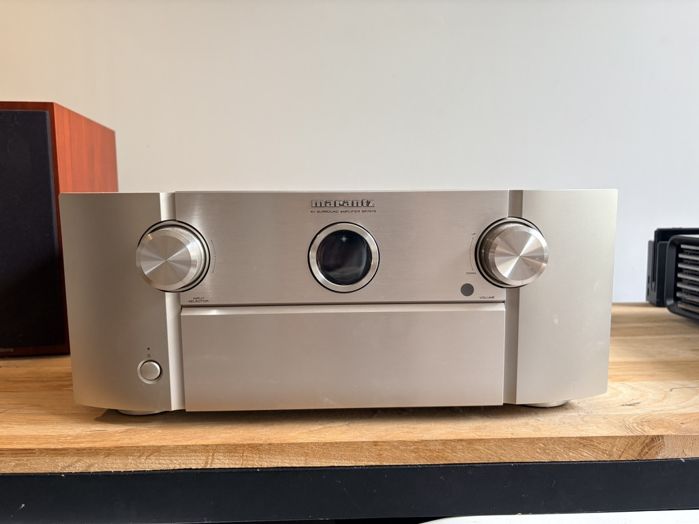

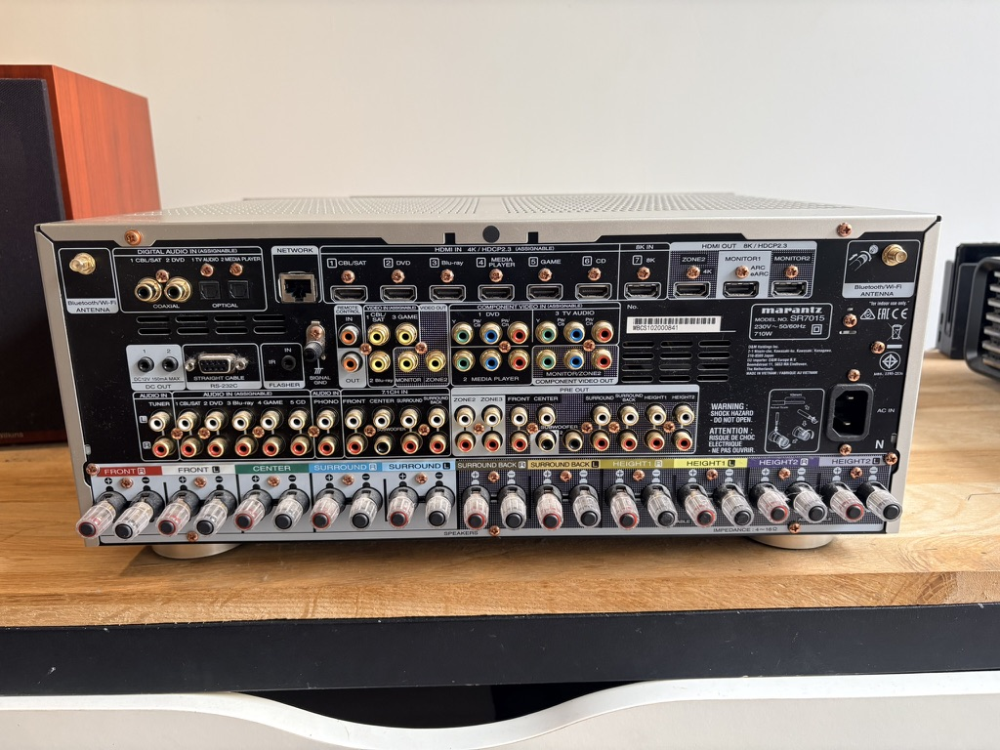

<!-- end_slide -->

> « Si tu ne possèdes pas un PCBA à 50 ans, tu as raté ta vie. »
> Jacques S, 2009.

> Tout est open source : le hardware (CERN-OHL-P) et le build system (MIT).
> `https://naguirre.github.io/mds-builder/`

<!-- end_slide -->

Le premier née dand la gamme MDS : Binky
===

# Binky(s)

<!-- column_layout: [1, 1, 1] -->

<!-- column: 0 -->

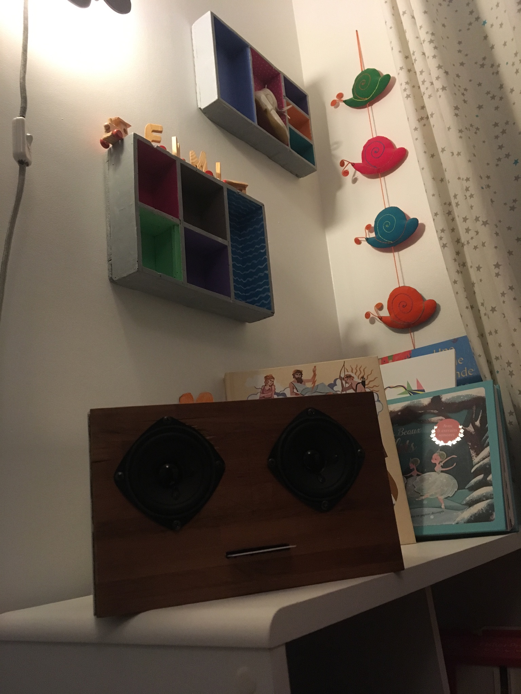

<!-- column: 1 -->

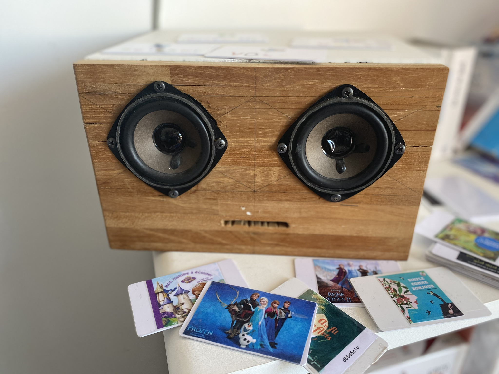

<!-- column: 2 -->

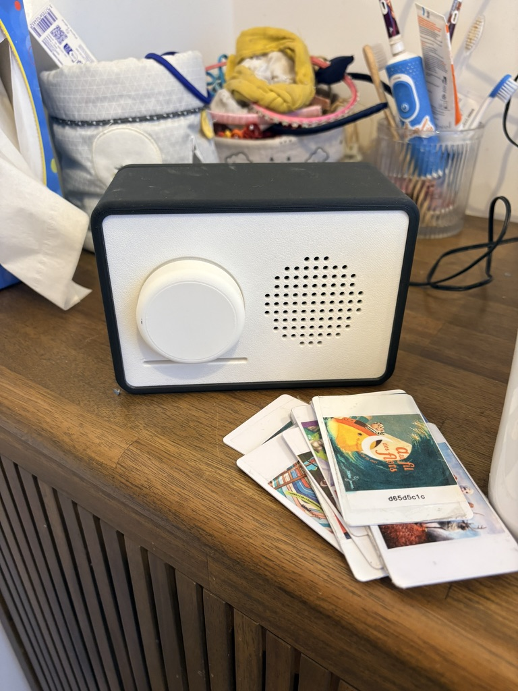

<!-- reset_layout -->

- « Binky », c'est une premier enceinte en bois faites main, pour ma fille de 3 ans. Une boîte à musique à cartes RFID 
- On présente une carte, elle joue l'album correspondant, pas d'écran, pas de boutons
- Parfait pour les tout petits. 
- A l'interieur une Raspberry PI zero + DAC et un lecteur RFID.


<!-- end_slide -->

Les boîtiers Binky
===

<!-- column_layout: [1, 1, 1] -->

<!-- column: 0 -->

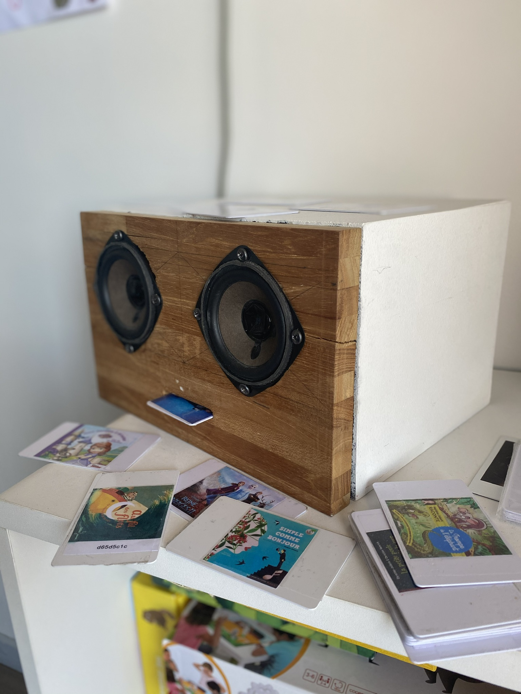

<!-- column: 1 -->

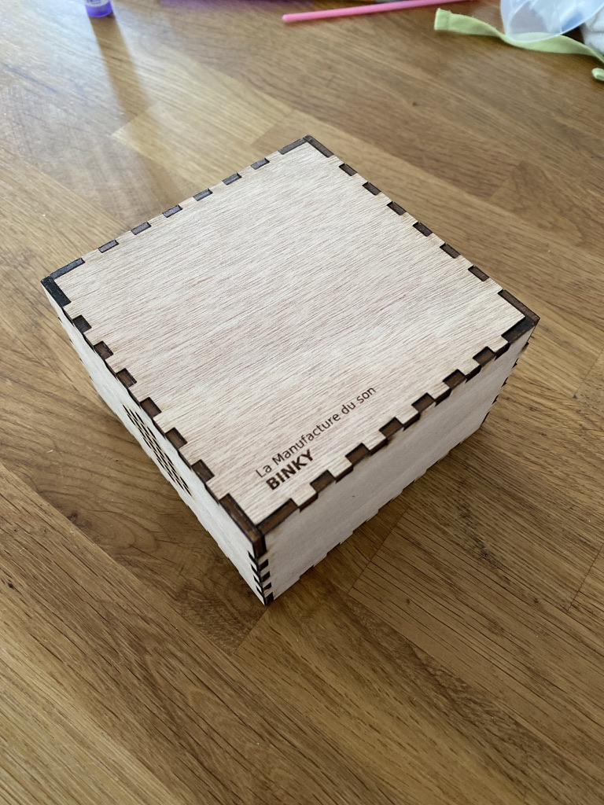

<!-- column: 2 -->

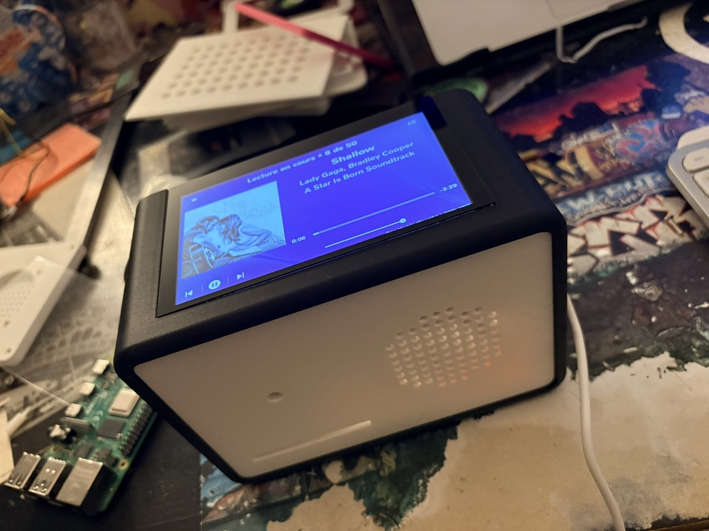

<!-- reset_layout -->

- Les binky ont evoluées avec mes enfants
- Quand les cartes on pas ete suffisantes, on a ajoute un ecran
- Et finalement pour les grands ca marchait bien aussi.
- On a meme une carte RFID france inter, et radio nova.

<!-- end_slide -->

Les premiers prototypes MDS
===

# De la breadboard à la carte sous la loupe

<!-- column_layout: [1, 1, 1] -->

<!-- column: 0 -->

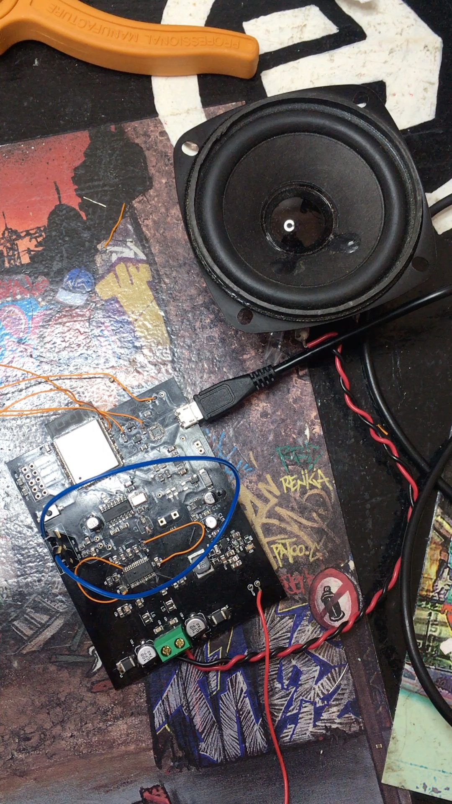

<!-- column: 1 -->

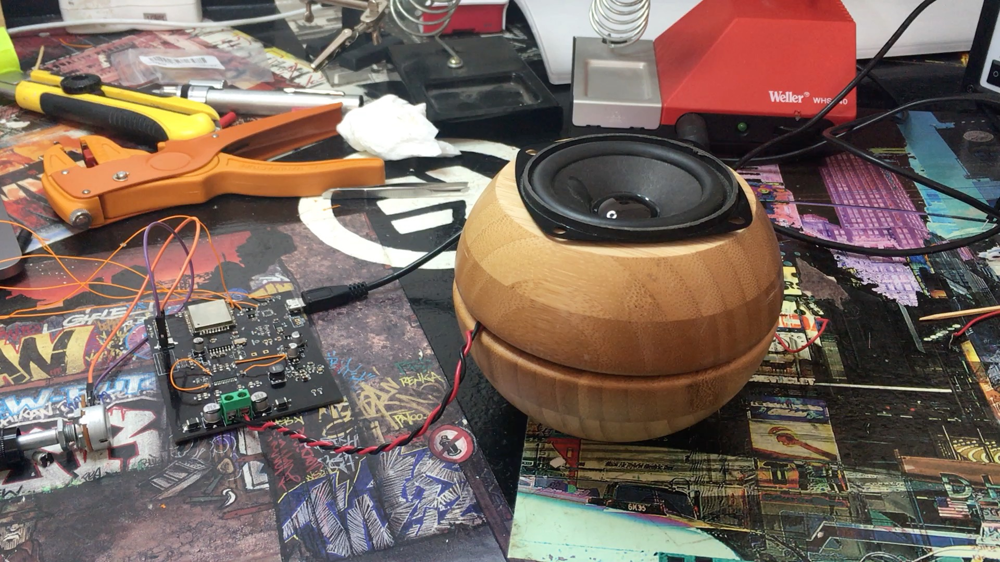

<!-- column: 2 -->

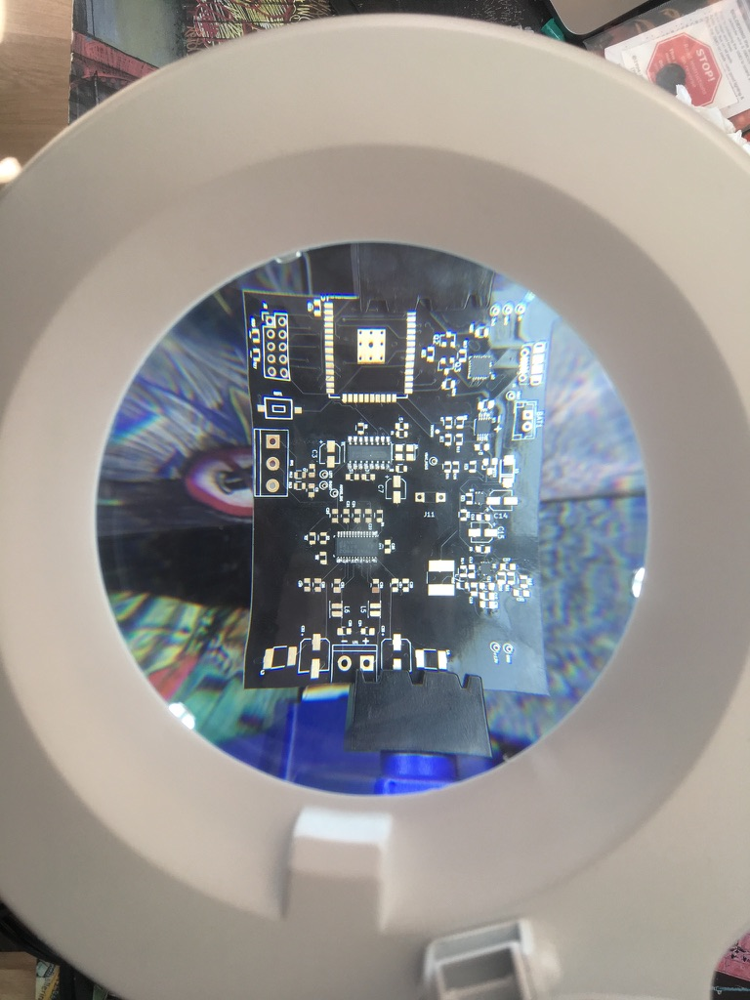

<!-- reset_layout -->
- En parallele, cette envie de ne pas utiliser de RPI
- Les premières cartes d'ampli MDS câblées. Just un ESP32 + amplid/dac TI
- Premier design PCB fabrique chez JLCPCB et soude a la main
- Le probleme c'est que l'ESP32 est un peu juste pour toutes les situations de decodage audio.
<!-- end_slide -->

Ce dont on va parler :
===


<!-- end_slide -->

Sommaire
===

1. Architecture matérielle
2. CAO avec KiCad
3. Routage et contraintes
4. Envoi en production (Chut, chut pas de marques)
5. Réception de la carte, bootstrap
6. La partie facile boot d'un U-Boot et Linux upstream

<!-- end_slide -->

L'inspiration
===

# Une carte de visite qui fait tourner Linux

<!-- column_layout: [1, 1] -->

<!-- column: 0 -->

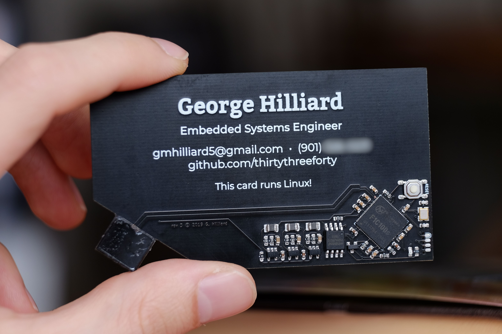

<!-- column: 1 -->

- La célèbre carte de visite F1C100s de George Hilliard qui démarre Linux

<!-- pause -->

> Crédit : George Hilliard, `github.com/thirtythreeforty`.
> Si un SoC tient sur une carte de visite, il tient dans un streamer réseau.

<!-- end_slide -->

1. Architecture matérielle
===

# Schéma de principe


<!-- end_slide -->

1. Architecture matérielle
===

# Les composants

<!-- column_layout: [3, 2] -->

<!-- column: 0 -->

**SoC principal, Allwinner F1C200s**

- ARM926EJ-S, ARMv5TE (C'est du rechauffé, c'est l'archi qui faisait le buzz quand je faisait mes etures)
- 64 MiB de DRAM intégrés dans le SoC
- Pas cher (en 2024), , support Linux mainline a 95%

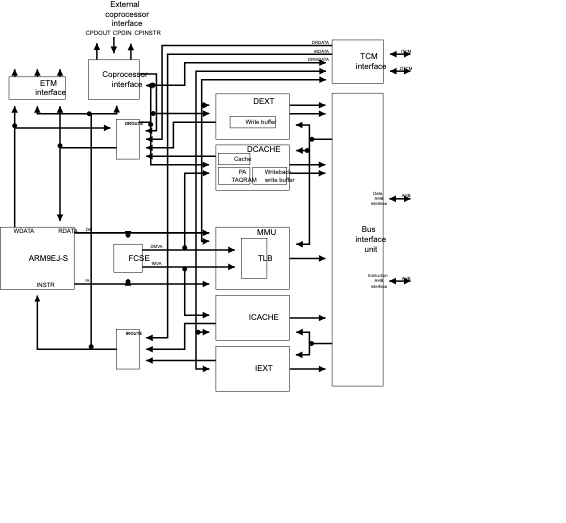

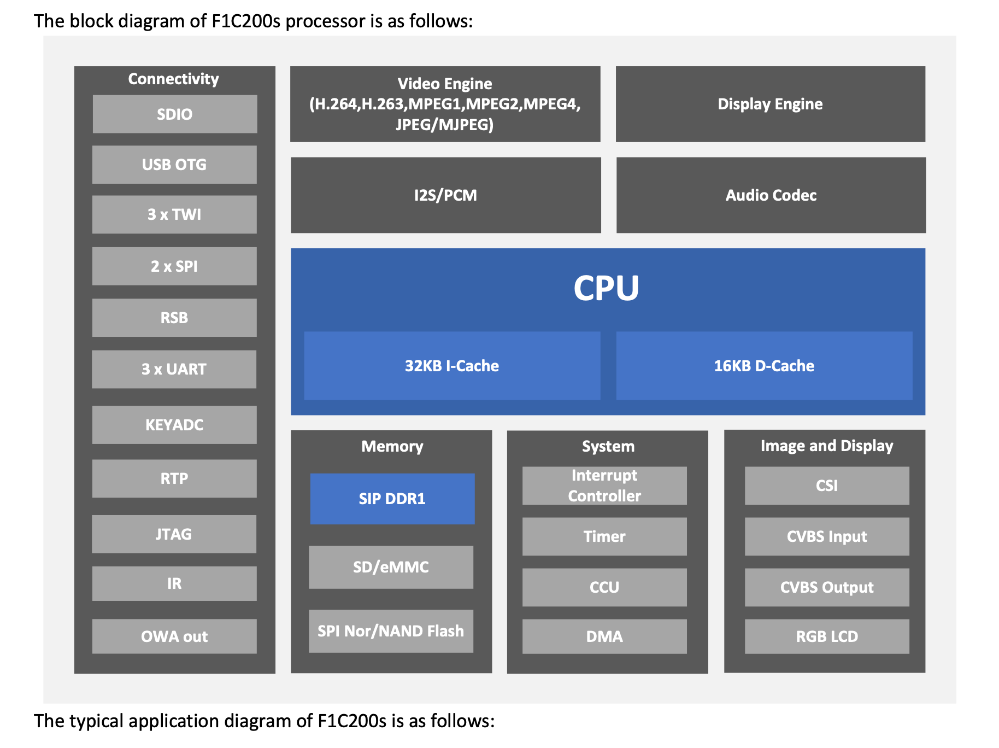

**Compagnon, ESP32-C3**

- Wi-Fi 2,4 GHz et BLE 5.0
- RISC-V 160Mhz
- 400 KiB RAM
- En module tout integre avec 8MiB de Flash

<!-- column: 1 -->

**Stockage**

- 128 Mio de NAND SPI (Winbond)

**Audio**

- Sortie SPDIF (`sun4i-spdif`)
- pas de DAC embarqué, par choix

**Alimentation et E/S**

- 5 V via USB-C
- USB OTG pour FEL et ethernet gadget
- Connecteur d'extension 40 broches

<!-- end_slide -->

1. Pourquoi cette combinaison
===

# Compromis de conception

- F1C200s : DRAM dans le boîtier, donc BOM minuscule et routage simplifié, soudure a la main envisageable. pas cher
- ESP32-C3 pour le WIFI et Bluetooth, [esp_hosted_ng](https://github.com/espressif/esp-hosted/blob/master/esp_hosted_ng/README.md). pas cher
- NAND SPI, largement suffisant pour un rootfs Buildroot. pas cher.
- Câble USB-C, Alimentation, FEL et ethernet gadget
- Alimentation 3Channels buck converters EA3036. pas cher.
- Un connecteur d'extension 40pins compatible RPI.
<!-- pause -->

> C'est bien 64MiB de RAM et 1Gbit SPI NAND (Obsolete depuis)

<!-- end_slide -->

2. CAO avec KiCad
===

# Dessiner la chose

- Conçu entièrement sous KiCad (7.x, puis 8.x en cours de route)
- Deux projets dans le dépôt sous `mds-hardware/` :
  - `network_player/`, la carte principale
  - `dac/`, une carte fille DAC audio optionnelle

<!-- pause -->

Le projet dac etait une tentative de DAC avec un ES9023. mort né, jamais cable


<!-- end_slide -->

2. Le schéma
===


<!-- end_slide -->

2. La carte en 3D
===

<!-- column_layout: [1, 1] -->

<!-- column: 0 -->

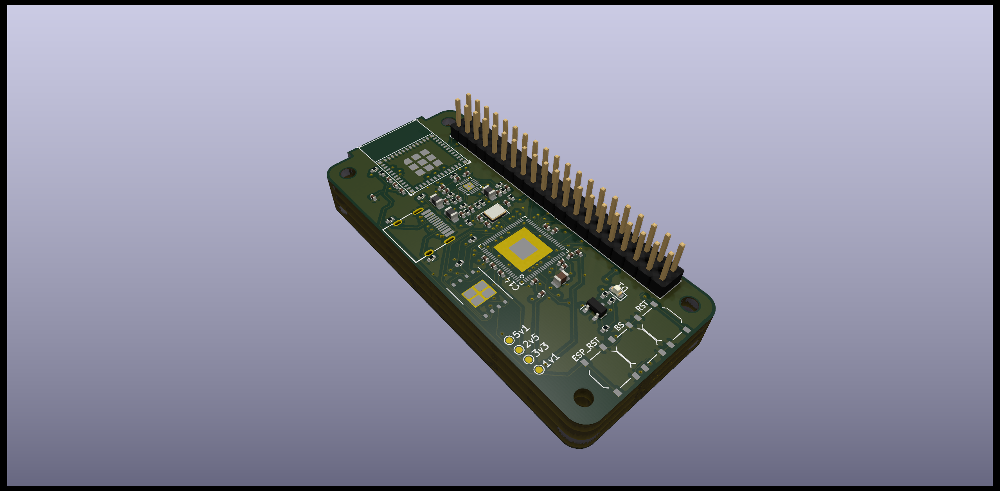

<!-- column: 1 -->

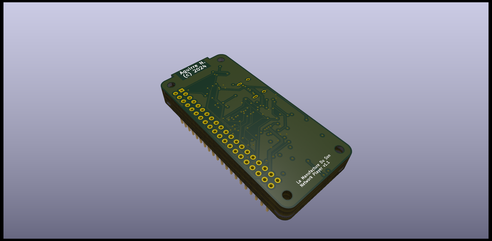

<!-- reset_layout -->


<!-- end_slide -->

3. Routage et contraintes
===

# Le rendre réel

Les parties intéressantes sont là où la datasheet du SoC rencontre la réalité :

- La DRAM est dans le boîtier, donc pas de prise de tete sur le routage DDR.
- La NAND SPI doit démarrer le BootROM, donc ce bus reste propre et court
- Partage du bus SPI : décider qui obtient quel bus est un choix de layout *et* de logiciel
- Broches de boot-strapping : le BootROM échantillonne les broches au reset, et un pull parasite
  t'envoie dans le mauvais mode de boot

<!-- pause -->

> L'essentiel de ma douleur de routage venait vraiment du boot-strap et de la logique de reset, pas de l'impédance.
> Sur une carte aussi petite, les pièges sont électrico-logiques, pas RF.

<!-- end_slide -->

4. Envoi en production
===

# JLCPCB

- KiCad fournit les gerbers, le perçage, la BOM et la CPL, que je téléverse sur JLCPCB
- Fabrication *et* assemblage (PCBA), ils placent les composants pour toi
- Tout est publié à côté de la doc sous `hardware/<version>/`

<!-- pause -->

```
KiCad  --plot-->  gerbers.zip
                     |
                     v
                 JLCPCB  -->  carte fabriquée et assemblée  -->  boîte aux lettres
```

<!-- pause -->

> Le délai de fabrication plus l'expédition est l'étape la plus longue de tout le projet.
> On apprend à regrouper ses erreurs avant de lancer la commande.

<!-- end_slide -->

5. Réception de la carte
===

# Premier allumage

Une carte vierge n'a rien en flash. Le BootROM est la seule chose en vie.

<!-- pause -->

## Le mode FEL à la rescousse

- Maintenir **BOOT**, appuyer sur **reset**, relâcher **BOOT**
- Le BootROM Allwinner bascule en FEL et apparaît comme un périphérique USB
- On pousse du code directement en RAM avec `sunxi-fel`, sans encore flasher

```sh
sunxi-fel uboot u-boot-sunxi-with-spl.bin \
  write 0x80000000 uImage \
  write 0x82800000 rootfs.cpio.uboot \
  write 0x83A00000 board.dtb
```

<!-- end_slide -->

5. Bootstrap
===

# De la RAM à une carte provisionnée

1. L'image en RAM seule démarre automatiquement sous Linux, un build de bootstrap dédié
2. Linux active un gadget ethernet USB, la carte est donc en `192.168.2.2`
3. `bootstrap.sh` se connecte en SSH et provisionne la NAND :

```sh
flash_erase /dev/mtd0 ...        # efface les partitions
ubiformat /dev/mtd2              # formate UBI
ubimkvol  ... rootfs             # crée le volume
flashcp spi-nand.bin /dev/mtd0   # écrit le bootloader
ubiupdatevol /dev/ubi0_0 rootfs.ubifs   # écrit le rootfs
reboot
```

<!-- pause -->

> Le livrer sous forme d'un unique `bootstrap-<version>.run` auto-extractible, pour que
> n'importe qui puisse flasher une carte vierge en une seule commande.

<!-- end_slide -->

5. Organisation de la NAND
===

# Ce qui vit où

| MTD | Taille | Contenu |
| --- | --- | --- |
| `mtd0` | 1 Mio | SPL et U-Boot |
| `mtd1` | 15 Mio | Recovery FOTA (UBI) |
| `mtd2` | 56 Mio | Rootfs principal (UBIFS) |
| `mtd3` | 56 Mio | Données et staging OTA |

<!-- pause -->

> La partition de recovery plus un échange atomique du rootfs, c'est ce qui rend possibles
> des mises à jour OTA sûres sur un appareil sans écran et sans boutons qui comptent.

<!-- end_slide -->

6. Le dev embarqué comme journal de bord
===

# La version honnête

Le joli schéma d'architecture cache environ un an de « mais pourquoi tu ne démarres pas ».

Voici la vraie chronologie.

<!-- end_slide -->

6. v1.0, janvier 2024
===

# Elle arrive, et elle riposte

<!-- column_layout: [1, 1] -->

<!-- column: 0 -->


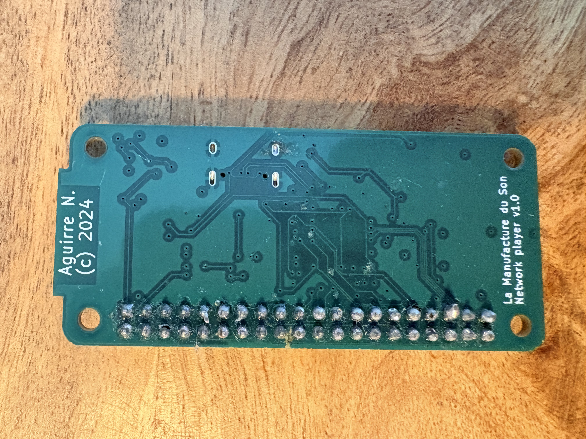

<!-- column: 1 -->

**15/01/2024, premières cartes de JLCPCB**

- Problèmes de routage autour de l'alimentation et du boot-strapping
- Boot et reset de l'ESP32 faits avec des transistors discrets, peu fiables
- Le boot flash se déclenchait alors qu'il n'aurait pas dû
- Les affectations de bus se battaient entre elles

> Leçon : le premier tirage est un outil d'apprentissage, pas un produit.

<!-- end_slide -->

6. Les anecdotes logicielles
===

# Des bugs qui ont mangé des week-ends

- `Wrong Image Type for bootm command`
  U-Boot mainline refusait l'uImage legacy, je suis donc passé aux images FIT
- `UBIFS error: LEB size mismatch: 129024 vs 126976`
  la géométrie UBIFS de Buildroot doit correspondre exactement au périphérique UBI à l'exécution
- `g_ether: couldn't find an available UDC`
  le contrôleur USB OTG était bloqué en mode host, une bataille de DTS
- Le SPL ne pouvait pas lire un payload depuis la NAND SPI tel quel,
  j'ai donc écrit `mknandboot.sh` pour reconditionner l'image attendue par le BootROM

<!-- pause -->

> Presque chaque bug venait d'un décalage entre deux couches qui semblaient chacune correctes
> isolément.

<!-- end_slide -->

6. v1.1, juin 2024
===

# Les corrections

<!-- column_layout: [1, 1] -->

<!-- column: 0 -->


<!-- column: 1 -->

**02/06/2024, le respin et la version produite**

- Suppression des transistors, le reset de l'ESP32 est maintenant piloté directement par un GPIO du F1C200s
- Ajout d'un bouton RST tirant MISO au niveau bas pour désactiver le boot flash
- Déplacement de l'ESP32 sur SPI1, SPI0 désormais partagé entre la NAND et le connecteur RPi
- Enable de l'EA3036 relié au 3,3 V

> C'est la carte qui fonctionne vraiment et qui joue de la musique.

<!-- end_slide -->

6. Le workflow au quotidien
===

# La boucle interne

Une fois qu'une carte démarre, l'itération est rapide :

```sh
make build-linux-rebuild     # recompile uniquement le noyau
make build-uboot-rebuild     # recompile uniquement le bootloader
```

- Pousser un module ou un noyau frais sur la carte en cours d'exécution via le lien USB-gadget
- Déboguer sur UART0 à 115200 avec `picocom`

```sh
ssh root@192.168.2.2
picocom -b 115200 /dev/ttyUSB0
```

<!-- pause -->

> Le temps de boot est journalisé et suivi : environ 24 s à froid (16/06/2024).
> Savoir où passent les secondes, scan UBI et chargement de l'uImage, te dit quoi
> optimiser.

<!-- end_slide -->

6. Le système de build
===

# Buildroot et BR2_EXTERNAL

```
mds-builder/
  Makefile               # fine surcouche autour de Buildroot
  buildroot_config/      # un defconfig par machine
  mds_external/          # BR2_EXTERNAL : boards, overlays, patches, FIT
```

- Buildroot 2026.02.1, builds reproductibles (`CONTAINER=1` pour Docker)
- Defconfigs et patches noyau et U-Boot personnalisés suivis dans le dépôt
- Plusieurs cibles machine : le lecteur, une image de bootstrap, le recovery FOTA,
  plus des cibles RPi et Anbernic pour prototyper l'application audio

<!-- pause -->

> Une seule commande `make build` te sépare d'une image flashable. Cette reproductibilité,
> c'est ce qui m'a permis de ne plus avoir peur du prochain respin.

<!-- end_slide -->

6. v2, octobre 2024
===

# Celle qui s'est échappée

- **17/10/2024**, une refonte complète sur l'Allwinner T113-s3, un SoC plus récent et plus costaud
- Schéma, PCB et gerbers tous terminés
- Jamais produite, la v1.1 était assez bonne et la vie a fait le reste

<!-- pause -->

> Tout projet de hardware ouvert a une v2 dans un tiroir. C'est très bien, c'est un loisir,
> pas une feuille de route.

<!-- end_slide -->

7. Le résultat
===

<!-- column_layout: [1, 1] -->

<!-- column: 0 -->


<!-- column: 1 -->


<!-- reset_layout -->

Une carte qui :

- démarre Linux mainline sur un SoC à moins de 5 $ et joue de l'audio en SPDIF
- se met à jour en toute sécurité via le réseau avec FOTA, sans aucun bouton requis
- est entièrement ouverte : schémas, gerbers, firmware et système de build

<!-- end_slide -->

À retenir
===

# Ce que je dirais à mon moi du passé

<!-- pause -->

- Choisis l'ouvert, choisis le mainline. Linux mainline plus KiCad m'ont permis de vraiment déboguer.
- Les bugs difficiles vivent entre les couches : bootrom et SPL, Buildroot et UBI, DTS et USB.
- Les builds reproductibles transforment un respin effrayant en un simple `make build`.
- Livre le bootstrap en une seule commande. Ton toi futur est le premier utilisateur.
- Le premier tirage te résistera. Prévois la v1.1 dès le premier jour.

<!-- end_slide -->

Merci
===

# La Manufacture du Son

Docs et sources : `https://naguirre.github.io/mds-builder/`

- Hardware : CERN-OHL-P v2
- Logiciel : MIT
- Construit avec : KiCad, Buildroot, Linux mainline, U-Boot, ESP-Hosted

<!-- pause -->

## Questions
